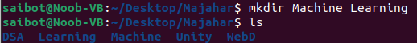
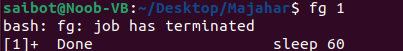

# Assingment 1 -
## Linux commands practise
### File related commands -

```
1.ls (list files): 
List  information  about  the FILEs
```


```
2.pwd (print working directory): 
Print the full filename of the current working directory.
```


```
3.cd (change directory): 
Navigates to a different directory.
```


```
4.mkdir (make directory): 
Create the DIRECTORY(ies), if they do not already exist.
```


```
5.mv (move or rename): 
Rename SOURCE to DEST, or move SOURCE(s) to DIRECTORY.
```


```
6.cp (copy): 
Copy SOURCE to DEST, or multiple SOURCE(s) to DIRECTORY.
```


```
7.rm (remove): 
This  manual  page  documents  the  GNU version of rm.  rm removes each specified file.  By default, it does not remove directories.
```


```
8.touch (create or update timestamps): 
Creates new empty files or updates timestamps of existing files.
```


```
9.ln (create links): 
In  the  1st form, create a link to TARGET with the name LINK_NAME.
```


```
10.cat (concatenate and print): 
Concatenate FILE(s) to standard output.
```


```
11.less (view files): 
Less is a program similar to more(1), but it has  many  more  features. Less  does  not  have to read the entire input file before starting, so with large input files it starts  up  faster  than  text  editors  like vi(1). 
```


```
12.grep (search): 
grep  searches  for  PATTERNS  in  each  FILE. 
```


```
13.head (display beginning): 
Print  the  first  10 lines of each FILE to standard output.  With more than one FILE, precede each with a header giving the file name.
```


```
14.tail (display end): 
Print  the  last  10  lines of each FILE to standard output.  With more than one FILE, precede each with a header giving the file name.
```


```
15.file (determine file type): 
file tests each argument in an attempt to classify it.
```


```
16.chmod(change file permissions):
chmod changes the file mode bits of each given file according to mode, which can  be  either  a  symbolic representation of changes to make, or an octal number representing the bit pattern for the new mode bits.
```


___

### Memory related commands -
```
1.free (display free memory): 
free  displays the total amount of free and used physical and swap memory in the system, as well as the buffers and caches used by  the  kernel. 
```


```
2.top (dynamically display processes): 
The  top program provides a dynamic real-time view of a running system.
```


```
3.vmstat (report virtual memory statistics): 
vmstat reports information about processes, memory, paging, block IO, traps, disks and cpu activity.
```


```
4.ps (report process status): 
ps displays information about a selection of the active processes.  If you want a repetitive update of the selection and the displayed information, use top instead.
```


___

### Process related commands -
```
1.kill (send a signal to a process):
The  default  signal  for  kill is TERM.  Use -l or -L to list available signals.  Particularly useful signals include HUP, INT, KILL, STOP, CONT, and 0. 
```


```
2.pkill (kill processes by name):
Terminates processes by name.
```


```
3.jobs (list background jobs):
Lists background jobs in the current shell.
```


```
4.fg (bring job to foreground):
Brings a background job to the foreground.
```


```
5.bg (run job in background): 
Sends a foreground job to the background.
```


___


### Networking commands -
```
1.ping (test network connectivity):
ping uses the ICMP protocol's mandatory ECHO_REQUEST datagram to elicit an ICMP ECHO_RESPONSE from a host or gateway. ECHO_REQUEST datagrams (“pings”) have an IP and ICMP header, followed by a struct timeval and then an arbitrary number of “pad” bytes used to fill out the packet.
```


```
2.ifconfig (configure network interface):
Ifconfig  is  used to configure the kernel-resident network interfaces.  It is used at boot time to set up interfaces as necessary.  After that, it is  usually  only  needed when debugging or when system tuning is needed.
```


```
3.netstat (display network connections):
Netstat prints information about the Linux networking subsystem.
```


```
4.traceroute (trace network path):
traceroute tracks the route packets taken from an IP network on their way to a given host.
```


```
5.wget (download files from web):
GNU Wget is a free utility for non-interactive download of files from the Web.  It supports HTTP, HTTPS, and FTP protocols, as well as retrieval through HTTP proxies.
```


```
6.curl (transfer data to/from servers):
curl is a tool for transferring data from or to a server. It supports these protocols: DICT, FILE, FTP, FTPS, GOPHER, GOPHERS, HTTP, HTTPS, IMAP, IMAPS, LDAP, LDAPS, MQTT, POP3, POP3S, RTMP, RTMPS, RTSP,  SCP,  SFTP, SMB, SMBS, SMTP, SMTPS, TELNET or TFTP. The command is designed to work without user interaction.
```


___

### Utility commands -
```
1.man (display manual pages):
man  is the system's manual pager.  Each page argument given to man is normally the name of a program, utility or function.  The manual page associated with each of these arguments is then  found and  displayed.   A section, if provided, will direct man to look only in that section of the manual.  The default action is to search in all of the available sections following a pre-defined order  (see  DEFAULTS),  and  to show only the first page found, even if page exists in several sections.
```


```
2.sudo (execute commands with superuser privileges):
sudo allows a permitted user to execute a command as the superuser or another user, as specified by the security policy.  The invoking user's real (not effective) user-ID is used to determine the user name with which to query the security policy.
```


```
3.clear (clear terminal screen):
clear  clears  your  screen  if this is possible, including its scrollback buffer (if the extended “E3” capability is defined).
```


```
4.echo (print text to the terminal): 
Echo the STRING(s) to standard output.
```


```
5.date (display or set the system date and time):
Display the current time in the given FORMAT, or set the system date.
```


```
6.cal (display a calendar):
The cal utility displays a simple calendar in traditional format and ncal offers an alternative layout, more options and the date of Easter.
```


```
7.whoami (print effective user ID): 
Print the user name associated with the current effective user ID. 
```


```
8.uname (print system information):
Print certain system information.
```


```
9.history (display command history): 
The GNU History library is able to keep track of those lines, associate arbitrary data with each line, and utilize information from previous lines in composing new ones.
```

___


**Author - Majahar Kazi**

Friday 26 January 2024 12:49:25 AM IST
