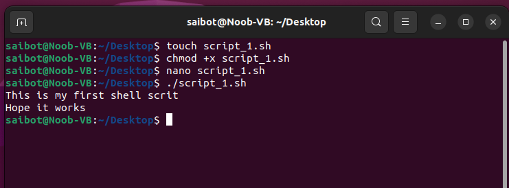
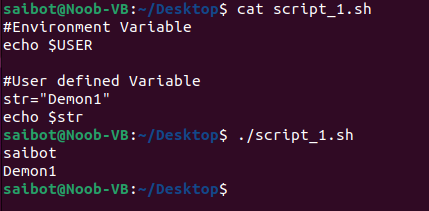

# **Assignment 2**
## **1.What is Shell scripting ?**

## **What is Shell** ?

A shell is a special user program that provides an interface for the user to use operating system services. Shell accepts human-readable commands from users and converts them into something which the kernel can understand. It is a command language interpreter that executes commands read from input devices such as keyboards or from files. The shell gets started when the user logs in or starts the terminal.

There are several shells are available for Linux systems like –

* **BASH** (Bourne Again SHell) – It is the most widely used shell in Linux systems. It is used as default login shell in Linux systems and in macOS. It can also be installed on Windows OS. 
* **CSH** (C SHell) – The C shell’s syntax and its usage are very similar to the C programming language. 
* **KSH** (Korn SHell) – The Korn Shell was also the base for the POSIX Shell standard specifications etc.

### **Shell Scripting** -

Usually, shells are interactive, which means they accept commands as input from users and execute them. However, sometimes we want to execute a bunch of commands routinely, so we have to type in all commands each time in the terminal.

As a shell can also take commands as input from file, we can write these commands in a file and can execute them in shell to avoid this repetitive work. These files are called Shell Scripts or Shell Programs. Shell scripts are similar to the batch file in MS-DOS. Each shell script is saved with **\`.sh\`** file extension e.g., myscript.sh.

A shell script has syntax just like any other programming language. If you have any prior experience with any programming language like Python, C/C++ etc. It would be very easy to get started with it.

A shell script comprises the following elements –

1. **Shell Keywords** – if, else, break etc.
2. **Shell commands** – cd, ls, echo, pwd, touch etc.
3. **Functions**
4. **Control flow** – if..then..else, case and shell loops etc.

### **How to Create a Shell Script in linux**

#### **Creating a Shell Script**

Open the directory where you want to build your shell script. Then use **touch** command for creating your shell script file privided your file name ending with **\'.sh\'** .
>#Syntax\
 touch <file_name>.sh 

> touch script_1.sh

The created script is not in executable mode by default, so we executable permission to our script. Use **chmod** command to change file mode, for executable we use **+x** following with file name.
>#Syntax\
 chmod \<mode> <file_name>.sh 

>chmod +x script_1.sh

Now, we will add some commands to this shell script. Open this shell script with any text editor of your choice and add some commands. In our case we are going to use nano, to open our script in nano script editor by
>#Syntax\
nano <file_name>.sh

>nano script_1.sh

The above command will open our script.sh in nano script editor. Now that our script is open we will add some commands to execute

>echo "This is my first shell script"\
echo "Hope it works"

When you are done with writing your commands save the file and exit back to terminal. On terminal to run the script use
>#Syntax\
./<file_name>.sh

>./script_1.sh

For writing a comment in shell script, \# is used in start of line.

#### **Variables in Shell Script -**
There are two types of varibles in shell script - 
* System defined variables (environment variables)
* user defined variables
  

### **Comparison Operators -**

**Integer comparison**
|Operator|Description|
|:---:|---|
|-eq|is equal to|
|-ne|is not equal to|
|-gt|is greater than|
|-ge|is greater than or equal to|
|-lt|is less than|
|-le|is less than oe equal|

**String Comparison**
|operator|Decription|
|:---:|---|
|==|is equal to|
|!=|is not equal to|
|\<|is less than, in ASCII alphabetical order|
|\>|is greater than, in ASCII alphabeticalorder|

### **Conditional statements -**
Conditional statements are used to execute a block of code only when certain conditions are met. 

1. **if** statement -\
It checks the condition, and if it is conditioned true, it executes the commands. 

>Syntax\
if [ condition ]\
then \
\<block of code>\
fi

>if [ $num -eq 5 ]\
then\
echo "Number is 5"\
fi

2. **if else** statement -\
The block of code in if statement are executed if the condition in if statement is true otherwise the statements in else commands will executed.

>Syntax\
if [ condition ]\
then\
\<block of code>\
else\
\<block of code>\
fi

>if [ $num -eq 10]\
then\
echo "Number is 10"\
else\
echo "Number is now 10"\
fi

3. **if-elif** statement -\
if we want to check multiple conditions for different executions we use if-elif statement, the command whose elif condition is true will be executed otherwise commands in else will be executed.

>Syntax\
if [ condition ]\
then\
\<block of code>\
elif [ condition ]\
\<block of code>\
else\
\<block of code>\
fi

>if [ $num -eq 10 ]\
then\
echo "Number is 10"\
elif [ $num -lt 10 ]\
echo "Number is less than 10"\
else\
echo "Number is greater than 10"\
fi

4. **Switch** statement -\
case statement works as a switch statement if specified value match with the pattern then it will execute a block of that particular pattern.When a match is found all of the associated statements until the double semicolon (;;) is executed. A case will be terminated when the last command is executed. Also when no case matches the '*' case is executed as default.

>Syntax\
case \<parameter> in\
c1) #First case ;;\
c2) #Seconde case ;;\
....\
*) #For default ;;\
esac

>case $num in\
1)echo "Digit is one" ;;\
2)echo "Digit is two" ;;\
...\
*) echo "Enter digit in 0-9" ;;\
esac

### **Looping statements -**
There are total 3 looping statements 

To alter the flow of loop statements, two commands are used they are,  
* break - To stop the loop
* continue - To skip the iteration

1. **for** loop -\
The for loop operates on lists of items. It repeats a set of commands for every item in a list. 
for example let, var be our iterating variable and value1 to valuen be space separated values it will iterate. The Each time the for loop executes, the value of the variable var is set to the next value in the list of value1, value2 to valuen. 

>Syntax\
for \<var> in <value1 value2 ... valuen>\
do\
    \<block of code>\
done

>for i in 1 2 3 4 5\
do\
echo "Current iteration = " $i\
done

2. **while** loop -\
The while loop runs on the basis of a condition till the condition is true, when the condition becomes false in the start of iteration the loop breaks.

>Syntax\
while [ condition ]\
do\
\<block of code>\
done

>a=0\
while [ $a -lt 10 ]\
do\
echo $a\
a='expr $a + 1'\
done

3. **until** loop -\
The until loop is executed as many times as the condition/command evaluates to false. The loop terminates when the condition/command becomes true. 

>Syntax\
until [ condition ]\
do\
\<block of code>\
done

>a=0\
until [ $a -gt 10 ]\
do\
echo $a\
a='expr $a + 1'\
done

___

## Cronjob -
A cron job is a scheduled task or job that is executed automatically by the cron daemon at specified time intervals on Unix-like operating systems. These jobs are often used for automating repetitive tasks, running scripts, or performing system maintenance. Each user on a Unix system can have their own set of cron jobs scheduled.

### **How to set up a cron job -**
1. Accessing the Crontab -
Use **'crontab -e'** command to edit the crontab file.

2. Cron job syntax -
>min hour dom mon dow cmd

|Field|Desciption|Value|
|---|---|:---:|
|min|Specifies the minute when the command will run|0-59|
|hour|Denotes the hour of the day when the command is scheduled to execute|0-23|
|dom|Specifies the day of the month for the task|1-31|
|mon|Indicates the month during which the command will be executed|1-12|
|dow|Specifies the day of the week for the task|0-6 where both 0 and 6 corresponds to Sunday|
|cmd|Represents the actual command or script that will run at the scheduled time|-|

example\
To run a script everyday at 11pm
>00 23 * * * /path/to/script.sh

3. Common special character -
* ' * ' : Wildcard, meaning "every".
* ' / ' : Used to specify intervals. For example, '*/5' in minute field means every 5 minutes.
* ' , ' : Used to specify lists of values. For example, '1,15' in hour field means at 1AM and 3PM.

4. Editing and managing Cron jobs -
* Use 'crontab -e' to edit cron jobs
* Use 'crontab -l' to list current cron jobs
* Use 'crontab -r' to remove all cron jobs

   
**Author - Majahar Kazi**\
Monday 05 February 2024 10:48:11 PM IST
